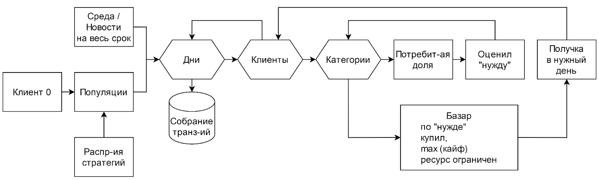

<H2>Agent-based consumer population model for research tasks,  forecasting and working out scenarios</H2>

The model is intended to study the influence of external circumstances, advertising recommendations and management decisions on the consumer behavior of agents individually, various social groups and the population as a whole, as well as for training and testing recommender systems.

The development includes a consumer model with customizable individual characteristics, a model of the external environment that allows for setting scenarios and includes recommendations from the system under study, a set of examples of creating a population and implementing scenario modeling.

The input is real world data or a given scenario of crisis events or management impacts;

The output is simulated transactions of individual agents and their aggregations in the area of consumer interest, in groups of agents and in the population as a whole, allowing one to make forecasts of consumer behavior under various variants of external factors or to judge the effectiveness of recommendations or management decisions.

<H3>Content</H3>
<LI><B>simulation.ipynb </B> - Jupyter notebook with demo example.</LI> 
<LI><B>data</B> - a folder with an example of real-world data on the environment for similation.</LI>
<LI><B>src/simulator.py </B> - python procedures for modelling of a customer behavoiur, creation of population and transactional activity simulating</LI>
<LI><B>src/environ.py</B> - example of environmental scenario realization
<H3>Process flow</H3>

<H3>Desk-top integration</H3>
Under construction...
